<!-- `> nix run .#skillIcon` -->  

<!-- BEGIN mdsh -->
 

<!-- END mdsh -->

Hi, I am Eveeifyeve 👋
-------------------------
*   🌍  I'm based in Australia
*   🔭  Im currently a developer at [@Opus-Client](https://github.com/Opus-Client) and CTO at [@NodeForge-Hosting](https://github.com/NodeForge-Hosting)
*   🚀  I'm currently working on: [@TeaClientMC](https://github.com/TeaClientMC) (Quality of Life Minecraft Client) & [@Minecraft-Essentials](https://github.com/Minecraft-Essentials) (Essnetails for Minecraft Client Launchers)
*   🌟  I specialize in fullstack and Minecraft Mod/Client Developer
*   ✉️  You can contact me [here](https://eveeifyeve.pages.dev/contact)

    
Github Stats ⚡️✍️

    

    

    
Roles ✍️✍️

<!-- `> nix run .#roles` -->

<!-- BEGIN mdsh -->
### Businesses
- DigitalBrewStudios: Owner/Proprietor (2025-present),
- OpusClient: Senior Software Engineer (2023-present),
- NodeForge: Senior Software Developer (2024-2025),
- DuvanMC: Junior Software Developer (2024-2024)

### Opensource Projects
- Nixpkgs: Windows Enablement and Packaging Team Member & Nim Packaging Team Member
<!-- END mdsh -->

    

<!-- `> nix run .#pin-tags` -->

<!-- BEGIN mdsh -->

<!-- END mdsh -->

